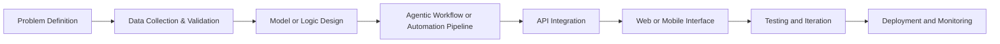

<!-- Premium Profile README -->

  

  

  
  
  

  
  
  
  

---

## Executive Profile

I am **Pranav Samadhan Khaire**, a B.Tech (Computer Science and Design) student at MIT, Chhatrapati Sambhaji Nagar, building practical AI systems with strong software engineering fundamentals.

My work sits at the intersection of **Machine Learning**, **Agentic AI**, **Automation**, and **Full-Stack Product Engineering**. I focus on building systems that are not only intelligent, but also stable, maintainable, and usable in real workflows.

---

## Professional Snapshot

| Category | Details |
| --- | --- |
| Role | AI/ML Engineer in Training, Full-Stack Builder |
| Education | B.Tech in Computer Science and Design (2nd Year) |
| Primary Specialization | Agentic AI, LangChain Agents, Workflow Automation |
| Secondary Specialization | Data Science, Backend APIs, Mobile Integration |
| Tools-First Mindset | Build reusable modules, automations, and deployment-ready systems |
| Current Objective | Internship and collaboration in AI product engineering |

---

## Internships & Professional Experience

### HEPro (A Unit of Great Leaders Institute Pvt. Ltd.)
**AI & Machine Learning Intern** | *12 January 2026 – 12 March 2026*
- Built an AI-powered student mentoring intelligence system (HEPro AI+).
- Developed algorithms for academic, wellness, productivity, and career readiness scoring.
- Applied machine learning (K-Means Clustering) for student segmentation and behavioral analysis.
- Designed mentor recommendation and intervention logic using Python, Pandas, Scikit-learn, and Data Analytics.

### 3Skill Training
**AI & Machine Learning Intern** | *2026*
- Focused on practical implementation and hands-on project-based learning.
- Developed industry-oriented AI/ML skills aligned with professional standards.
- Strengthened knowledge of machine learning concepts, analytical thinking, and practical software development.

---

## What I Build

### Agentic AI Systems

- Design and implement **LangChain agent pipelines** with tool usage and chaining.
- Build **multi-step reasoning workflows** for planning, execution, and decision support.
- Integrate agents with **APIs, data stores, and backend services**.
- Structure **prompt and memory strategies** for consistent and controlled outputs.
- Create practical assistants for analytics, recommendations, and productivity automation.

### Automation Engineering

- Develop **Python automation scripts** for repetitive technical workflows.
- Build **API-connected orchestration** pipelines for data movement and task execution.
- Create automations for reporting, scheduling, and operational efficiency.
- Design reusable automation modules with clear inputs, outputs, and monitoring.
- Improve reliability through modular logic and testable flow design.

### Mobile APK Integration

- Work with **mobile-first application design** and backend-aware feature planning.
- Understand Android **APK lifecycle**: build, package, version, and release readiness.
- Integrate mobile clients with APIs for authentication, data sync, and service calls.
- Bridge AI/ML features into mobile-oriented product workflows.
- Drive prototype-to-release discipline with practical engineering checkpoints.

### AI/ML and Data Science

- Build end-to-end ML pipelines: preprocessing, feature engineering, training, evaluation.
- Use **NumPy, Pandas, scikit-learn, Matplotlib** for data-driven model development.
- Apply NLP foundations to language-centric applications and recommendation use cases.
- Connect model outputs to real interfaces and business logic.
- Prioritize explainability, reproducibility, and meaningful performance metrics.

### Full-Stack and Backend Delivery

- Build **Flask REST APIs** with modular architecture and clean routing.
- Deliver responsive frontends using **HTML, CSS, JavaScript, Tailwind CSS, React, Vite**.
- Work with **MongoDB, MySQL, SQLite** for structured and semi-structured data.
- Implement integration-ready systems from frontend to backend to database.
- Focus on security basics, API consistency, and maintainable code structure.

---

## Engineering Architecture Mindset

I follow a system-first approach where AI is one layer of the solution, not the entire solution.

---

## Deep Skill Matrix

| Domain | Practical Depth | Tools and Frameworks | Delivery Outcome |
| --- | --- | --- | --- |
| Agentic AI | Multi-step agents, tool chaining, retrieval-aware orchestration | LangChain, Python, API integrations | Intelligent assistants and automated decision flows |
| Automation | Workflow scripting, API process orchestration, repeatable pipelines | Python, REST APIs, schedulers, structured scripts | Time-saving production automations |
| Mobile APK Workflows | Build/package understanding, backend integration, service-driven features | Android APK process, API layer integration | Mobile-ready AI-enabled application flows |
| ML Engineering | Data pipelines, model evaluation, visualization, feature processing | NumPy, Pandas, scikit-learn, Matplotlib | Predictive and recommendation modules |
| Backend Engineering | API design, routing, integration patterns, data handling | Flask, REST, MongoDB, MySQL, SQLite | Reliable backend services |
| Full-Stack Product Delivery | UI + API + data synchronization | JavaScript, React, Tailwind CSS, Flask stack | Deployable end-to-end products |
| DevOps Foundations | Containerization and CI fundamentals | Docker, GitHub Actions | Reproducible builds and streamlined deployment |

---

## Tech Stack

### Languages

  
  
  
  
  

### Agentic AI, ML, and Data

  
  
  
  
  
  
  
  

### Backend, APIs, and Data Layer

  
  
  
  
  

### Frontend and Mobile Integration

  
  
  
  
  

### DevOps and Workflow Tools

  
  
  
  
  
  

---

## Portfolio Highlights

### 1) Blue Carbon MRV System
**Purpose**: Environmental monitoring, reporting, and verification workflow support.
**Engineering Work**: Structured data processing, geospatial data interpretation, and workflow clarity for monitoring tasks.

### 2) PM Internship Allocator
**Purpose**: Internship matching and allocation assistance system.
**Engineering Work**: Full-stack workflow, database-backed candidate/internship data handling, and allocation logic.

### 3) OverthinkAI
**Purpose**: Multi-agent collaborative intelligence system for complex task processing.
**Engineering Work**: Agentic architecture, tool chaining, and automated decision flows.

### 4) Future Skills and AI Advisor
**Purpose**: AI-powered skill and learning recommendation system.
**Engineering Work**: Recommendation logic, ML-driven guidance, and user-facing output design.

### 5) SentinelRx AI
**Purpose**: AI-driven healthcare insights and analysis.
**Engineering Work**: Deep learning models for medical data, integrated with a secure backend.

### 6) Zerocarbonix
**Purpose**: Sustainability tracking and carbon footprint reduction platform.
**Engineering Work**: Data analytics, full-stack implementation, and predictive modeling for emission reduction.

### 7) HealthSpire
**Purpose**: Comprehensive health tracking and predictive diagnostic tool.
**Engineering Work**: Health data aggregation, predictive ML algorithms, and intuitive frontend dashboard.

### 8) Agri Connect
**Purpose**: Digital platform concept for agriculture connectivity and service access.
**Engineering Work**: End-to-end full-stack integration with backend service logic for agricultural workflows.

---

## Achievements and Competitions

- **Winner (Sharkpreneur)**: ZENTRIX'26 Pitch Competition (Mar 2026)
- **1st Prize**: Lightning Pitch 2026 (Feb 2026)
- **1st Prize**: Cogni-Sphere 2025 (IETE, MIT CSN, Oct 2025)
- **2nd Prize**: SANKALPANA 2025 (District Level, Nov 2025)
- **Runner-Up**: Honeywell Sustainability Innovation Challenge (Mar 2026)
- **State Level Finalist**: DIPEX 2026 Working Model Exhibition (Mar 2026)
- **Qualified Round 1**: Build for Bharat National Innovation Hackathon (Apr 2026)
- **Participant**: HackSphere 2025, HackFusion 3, IGNITION 2K26, IDE Bootcamp, IDEATHON 9.0, Government College Ideathon.
- **30+ certifications and badges** across Microsoft, Oracle, Google Cloud, TCS iON, HCL, IBM, Simplilearn, HP LIFE, and others.
- **12+ completed projects** across AI/ML, web platforms, and full-stack systems.

---

## Selected Certifications

- TCS iON - Career Edge (Young Professional), completed on **10 Nov 2025**.
- Oracle - OCI AI Foundations Associate, issued on **11 Nov 2025** (valid until **11 Nov 2027**).
- Microsoft and HCL - SOAR and Azure AI badges (Oct-Nov 2025).
- Google Cloud (Simplilearn) - Introduction to Generative AI, issued on **30 Nov 2025**.
- IBM SkillsBuild - AI Literacy Verified Badge, issued on **26 Oct 2025**.

---

## Current Focus (2026)

- Advanced data science workflows and robust model evaluation.
- Agentic AI architecture using LangChain and tool ecosystems.
- Reliable automation systems for real operational use.
- Deployment discipline aligned with MLOps principles.
- Mobile + backend integration with APK-ready release practices.

---

## Professional Values

- **Problem-first engineering**: Start from user needs and measurable goals.
- **Reliability over hype**: Build maintainable systems with consistent behavior.
- **Execution quality**: Design modular code and reusable architecture.
- **Continuous growth**: Learn fast, ship often, improve based on evidence.
- **Ownership mindset**: Communicate clearly and deliver accountable results.

---

## GitHub Analytics

  

  

  

  

---

## Connect With Me

- Portfolio: <https://pranav-portfolio16.netlify.app/>
- LinkedIn: <https://www.linkedin.com/in/pranav-khaire-732793338>
- GitHub: <https://github.com/pranav16-king>
- Email: <mailto:pranavkhaire53@gmail.com>
- Twitter/X: <https://twitter.com/pranavkhaire16>
- Instagram: <https://www.instagram.com/pranav_khaire___/>

---

<strong>Building consistent systems. Solving practical problems. Growing with every release.</strong>

